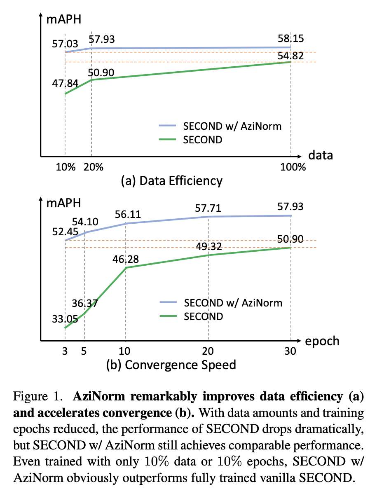

# AziNorm
AziNorm: Exploiting the Radial Symmetry of Point Cloud for Azimuth-Normalized 3D Perception, CVPR 2022.

Paper and code are coming soon.

## Introduction
Studying the inherent symmetry of data is of great importance in machine learning. Point cloud, the most important data format for 3D environmental perception, is naturally endowed with strong radial symmetry. In this work, we exploit this radial symmetry via a divide-and-conquer strategy to boost 3D perception performance and ease optimization. We propose Azimuth Normalization (AziNorm), which normalizes the point clouds along the radial direction and eliminates the variability brought by the difference of azimuth. AziNorm can be flexibly incorporated into most LiDAR-based perception methods. To validate its effectiveness and generalization ability, we apply AziNorm in both object detection and semantic segmentation. For detection, we integrate AziNorm into two representative detection methods, the one-stage SECOND detector and the state-of-the-art two-stage PV-RCNN detector. Experiments on Waymo Open Dataset demonstrate that AziNorm improves SECOND and PV-RCNN by $7.03$ mAPH and $3.01$ mAPH respectively. For segmentation, we integrate AziNorm into KPConv. On SemanticKitti dataset, AziNorm improves KPConv by $1.6/1.1$ mIoU on val/test set. Besides, AziNorm remarkably improves data efficiency and accelerates convergence, reducing the requirement of data amounts or training epochs by an order of magnitude. SECOND w/ AziNorm can significantly outperform fully trained vanilla SECOND, even trained with only $10\%$ data or $10\%$ epochs.

